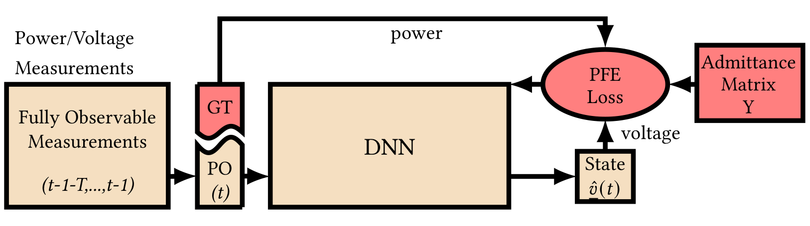

# Physics-Informed Deep Neural Network Method for Limited Observability State Estimation of a Distribution Power Grid



The goal of the study is to accurately estimate the state of the distribution power grid, which is defined as the voltage magnitudes and angles of all the buses in the grid. Our proposed approach exploits the following physical properties of the distribution grid in order to achieve accurate state estimation:
1) Admittance matrix
2) Power Flow Equations (AC-model)

This physical information is used as a regularizer during a deep neural network (DNN) training, leading to superior estimation accuracy of the grid state. We evaluate the performance in presence of limited grid observability, where less than half of the buses report any measurement, and with a high penetration of photovaoltaic (PV) panels. We compare our DNN model against a persistent guess and a Weighted-Least-Squares solution.

Full article: https://arxiv.org/pdf/1910.06401.pdf

## Installation
The installaion requires Python 3.6.8. The sources and the required packages can be installed by running the following code in the terminal:
```
git clone https://github.com/kostyanoob/Power.git
cd Power
pip install -r requirements.txt
```

## Citation
If you build up on our research, please cite us:
```
@article{ostrometzky2019physics,
  title={Physics-Informed Deep Neural Network Method for Limited Observability State Estimation},
  author={Ostrometzky, Jonatan and Berestizshevsky, Konstantin and Bernstein, Andrey and Zussman, Gil},
  journal={arXiv preprint arXiv:1910.06401},
  year={2019}
}
```

## Action items for this repository
1) write a ```runme.sh``` script for a reproduction of the experiments, add it to 
2) consider removing ```generate_plots.py```, as we only use ```generate_plots_with_wls.py```.
3) fix the ```PFE_check.py``` script. Currently it doesn't accomodate the up-to-date load_dataset method.
4) add a pretrained _neuralnet_ model for quickly testing it and showing chronological plots and other results. Add a command line that a user needs to run for it.
5) add to readme.md a command line for running a _WLS_ model
